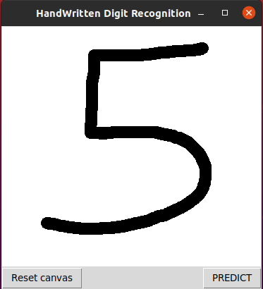
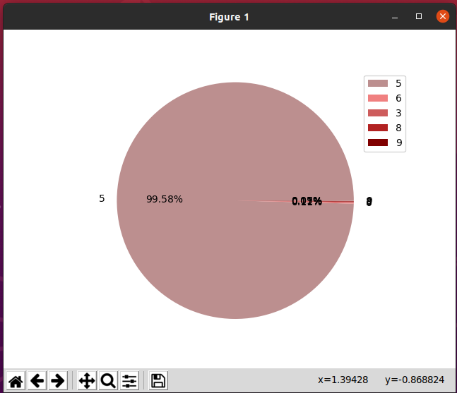

## This is a part of Smart Whiteboard Project, a web application with INK to Text feature, which snapshots selected area of handwritten words/paragraph and then by OCR returns a text box with TEXT Result.
